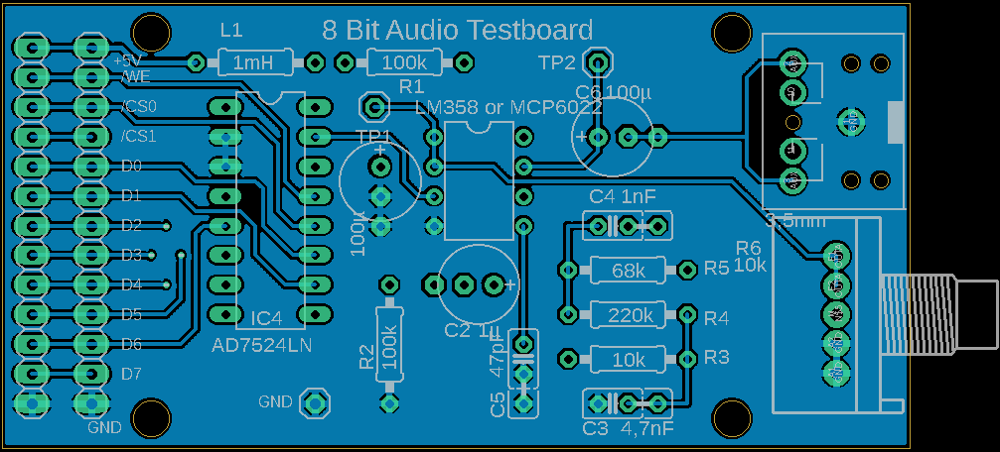
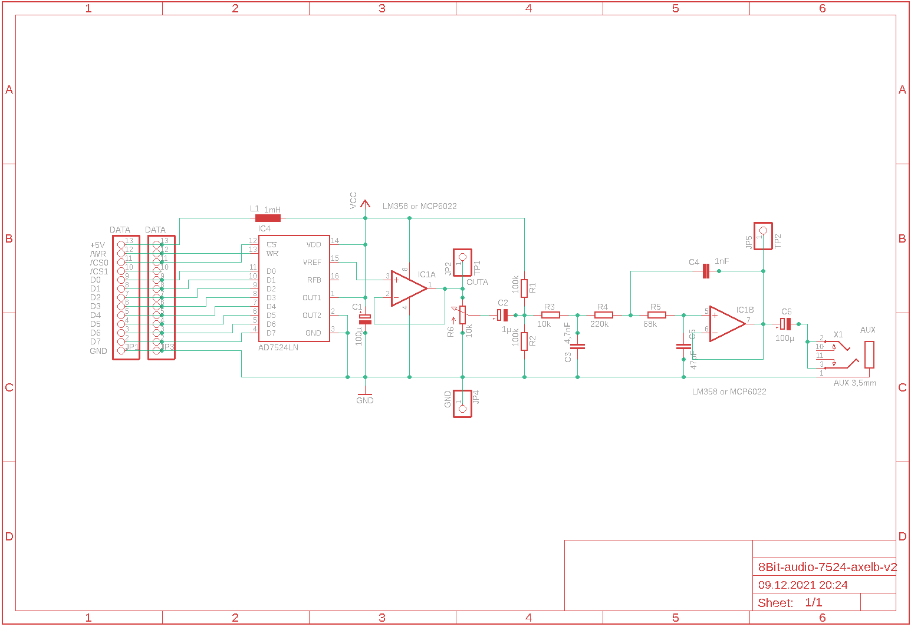
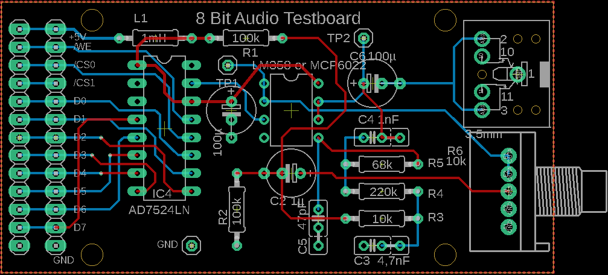
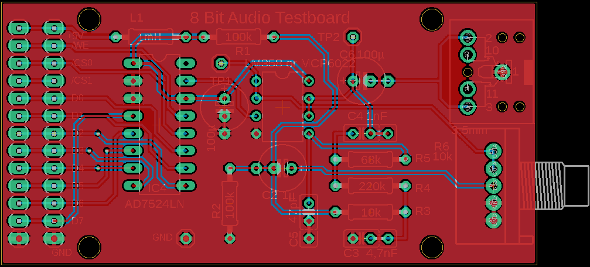

8 Bit Audo with the TLC7524 Rev. 2
==================================

It is the second draft that tries to avoid the mistakes of the first version. The connection to VREF (15) has been changed. The pin header was adapted to the PCB of lb3361. This means that a 1 to 1 cable can be used. Component footprints have been improved.
! This is just a draft.

