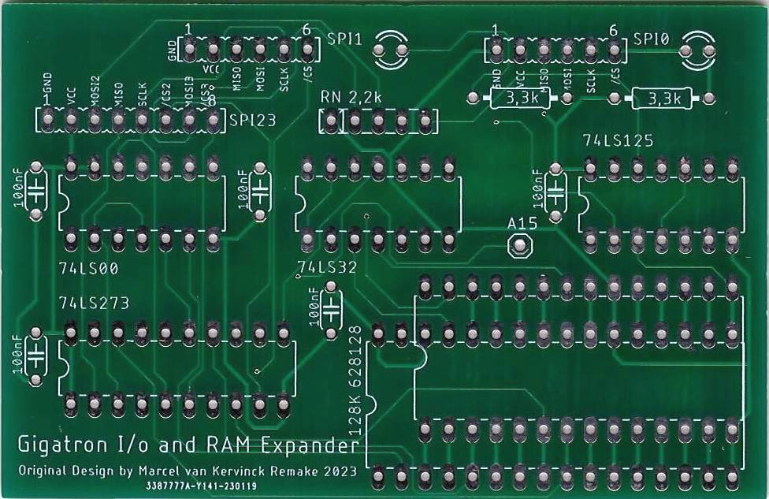
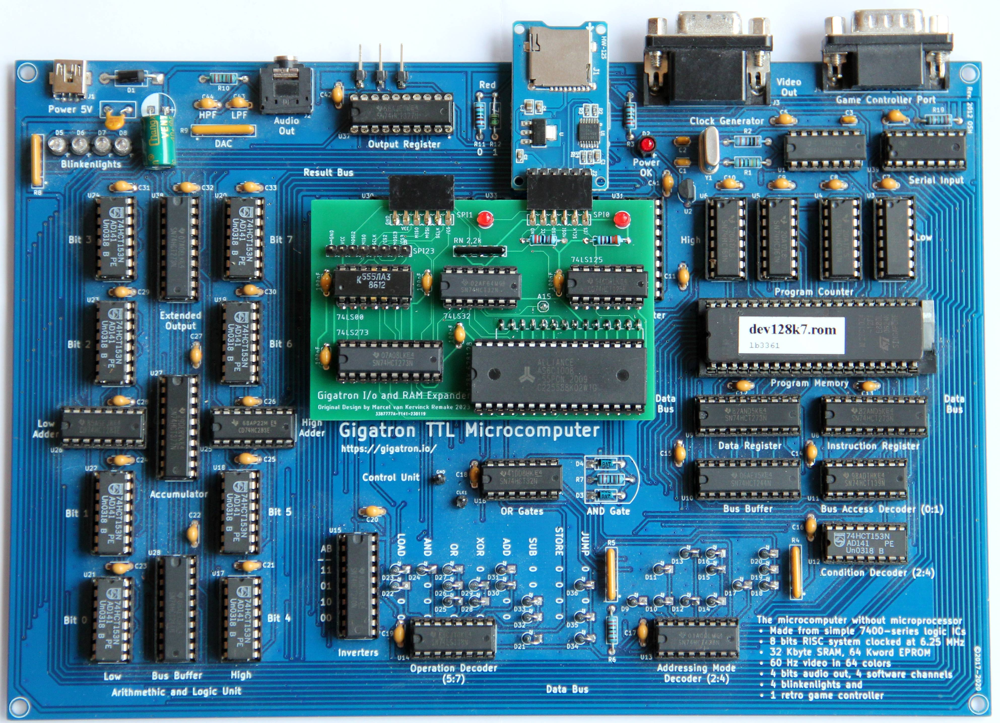
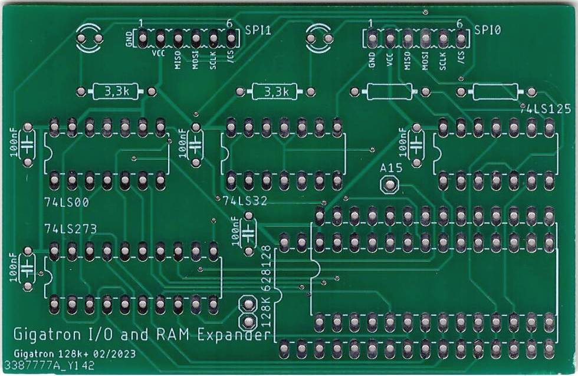
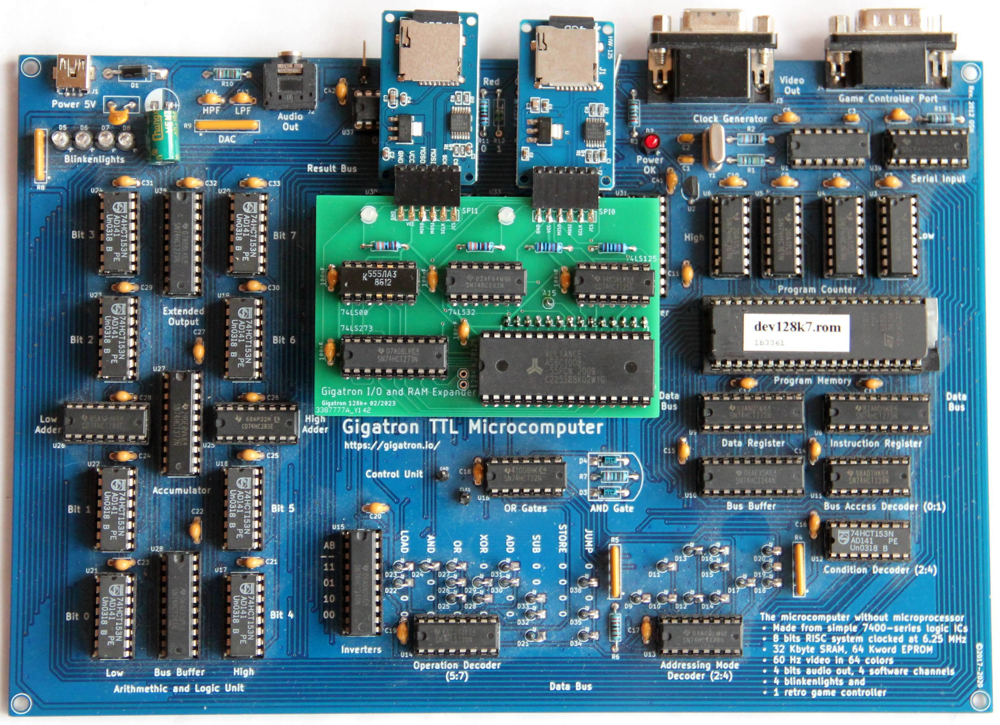

# Gigatron Extension 128k+

The 128k+ extension provides 128 kbyte RAM and an SPI interface for the Gigatron.
The first draft was discussed here: https://forum.gigatron.io/viewtopic.php?f=4&t=64

Another extension is lb3361's expansion-retro https://github.com/lb3361/gigatron-lb/tree/main/extension-retro.
It uses two GAL and extends the original with additional I/O functions. The GAL also allows changes to the function through GAL programming.

For all those who don't want GALs and for the new "dev128k7.rom" from lb3361 I made a new PCB from Marcel's original. The extension includes all the latest changes and pin header for two SD card breakout.

In the end there were two PCBs because an old problem reappeared while testing the first one. DANGER! the original circuit does not work with two SD cards and the current ROMs.
This is partly due to the SD cards, which only behave like SPI devices after they have been switched to this mode. The second problem is the SD breakout boards used, which permanently put the MISO signal on the output, independent of /CS. In the original circuit, the MISO signals are separated by the hardware, but they are combined again in the ROM ("anda(0b00001111) #28+i*12 This is why R1 as pull-DOWN is simpler").
One way to solve the problem is to modify the breakout, which requires some skill. The second possibility is to solve it with hardware. I did that with the second PCB. I borrowed two gates from the 74125 for the solution. This reduces the available SPI on this PCB from 4 to 2.

I built and tested both PCBs. They work as expected.

