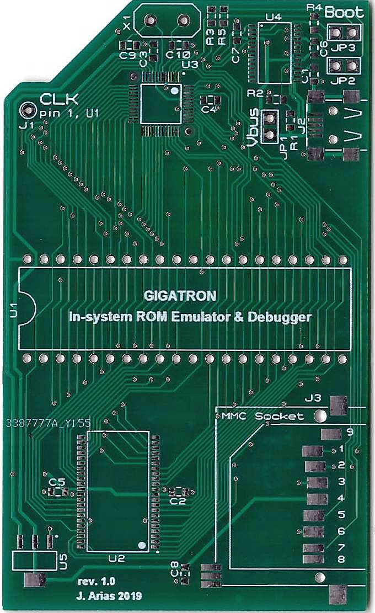
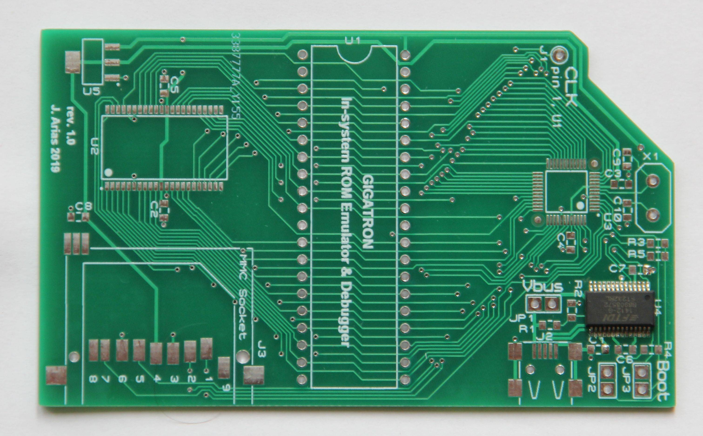
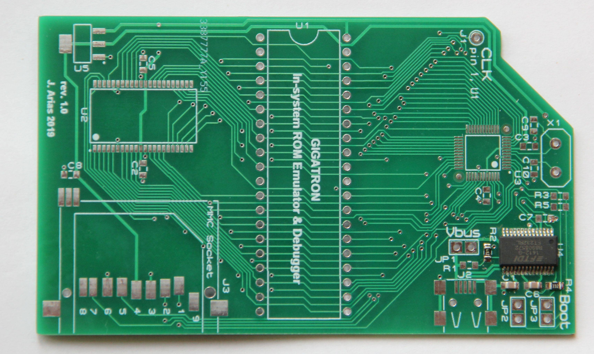
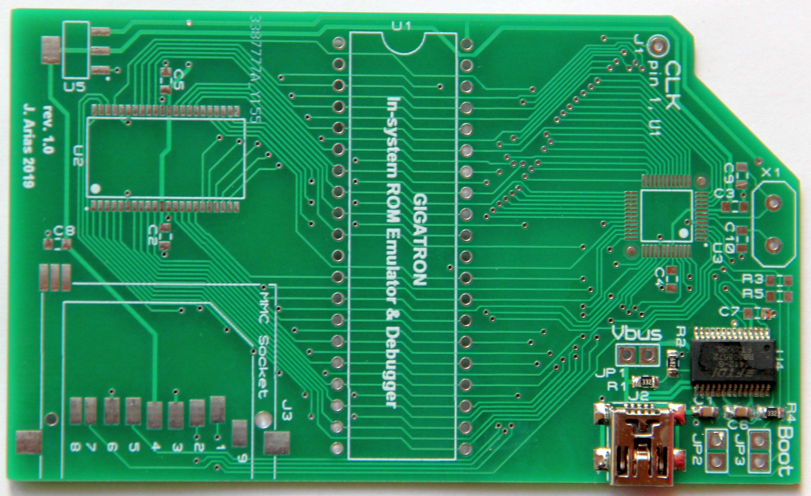
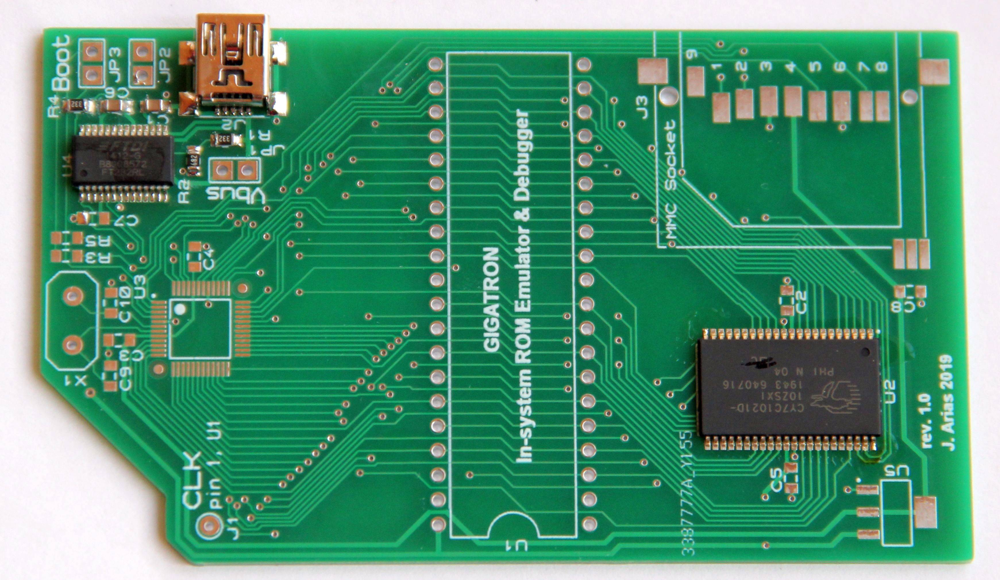
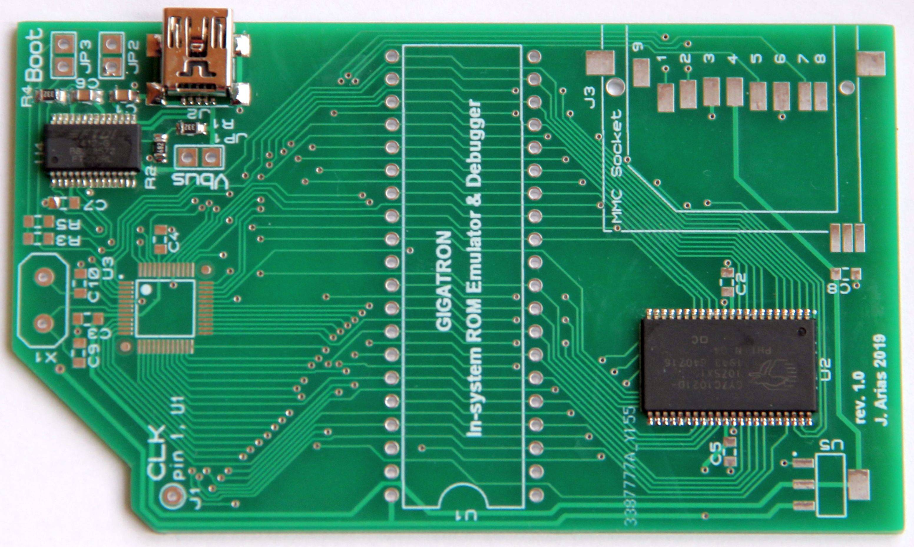
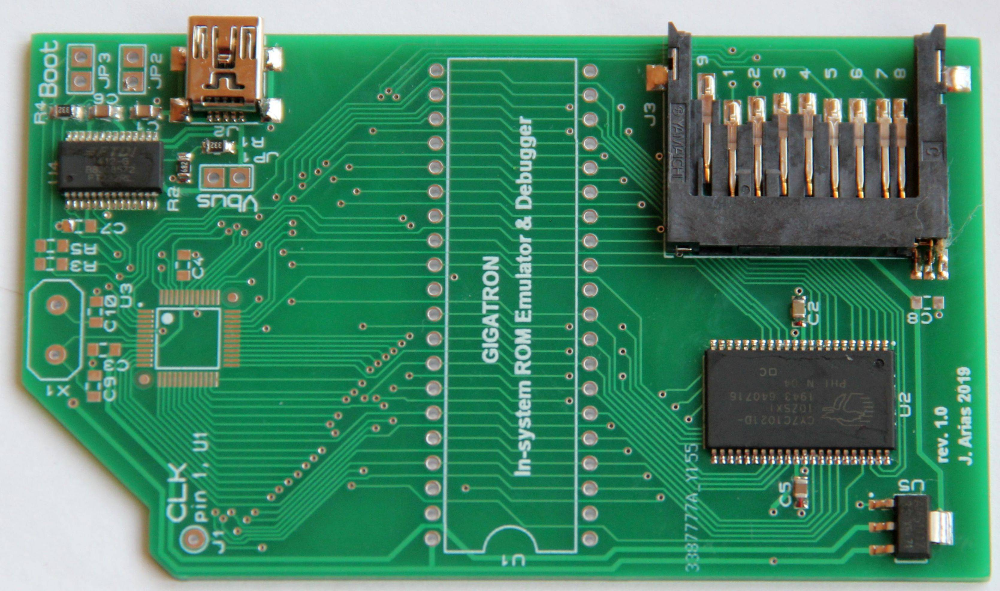
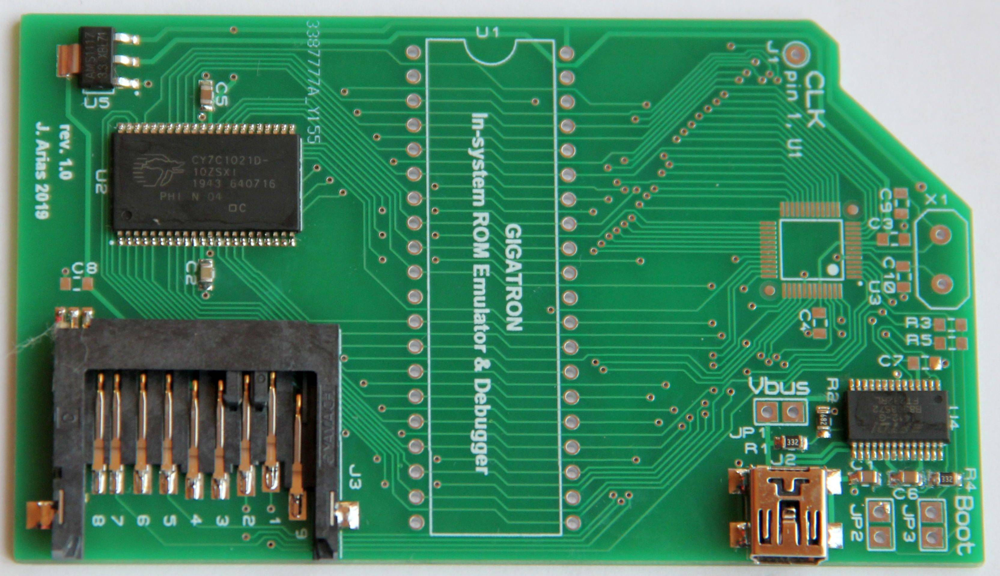
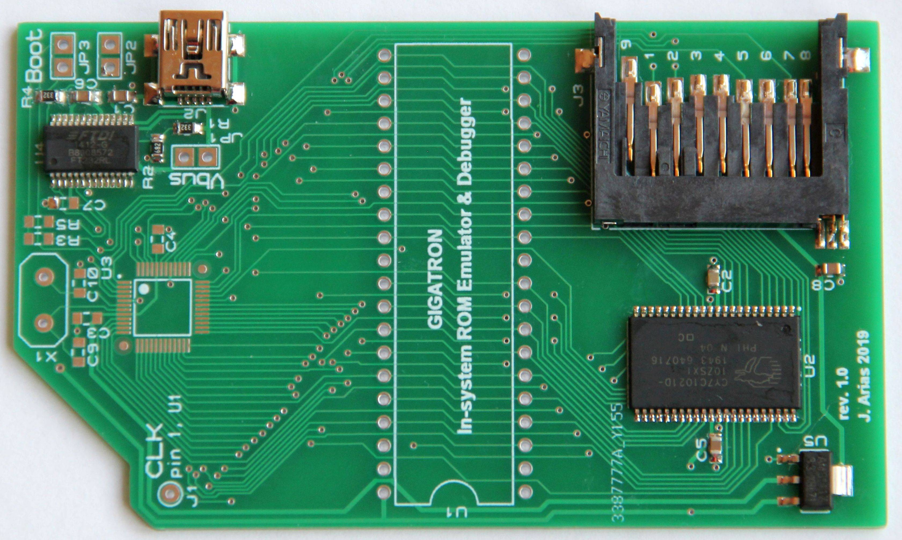

# My pictures of soldering

My PCB from JLCPCB

Soldering FDI FT232R

Soldering R2, C1, C6 and R4

Soldering J2 USB-F-TYPE MINIB and R1

Soldering U2 RAM fix component

Soldering U2 RAM finish

Soldering J3 SDCARD SOCKET

Soldering J3 SDCARD SOCKET

Soldering C8

Waiting for delivery of the LPC1114

