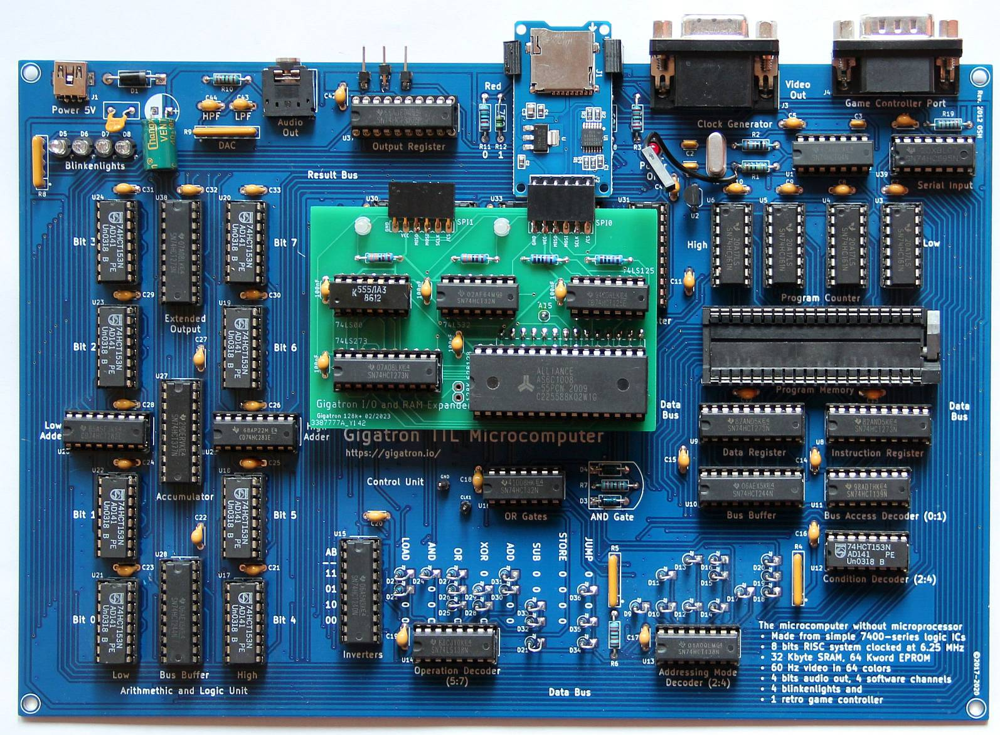

# Notes on the electrical connection with the Gigatron

At the ISD I use turned pins for the connection. These give a very good fit in an IC socket with turned contacts. In case of a ZIF socket on the Gigatron, I recommend to insert an IC socket into it. You should be careful with the turned contacts on the ISD, they break off easily when bent.
You also need a connection from the CLK output on the ISD to the Gigatron. The easiest way is to solder a jumper cable to R1 (connection R1 Y1, see pictures). The cable does not interfere with the use of a normal ROM.

**CLK wire on the Gigatron**

**ZIF socket with ic socket**

**Gigatron with ISD**

[Back to the overview](https://github.com/hans61/Gigatron-TTL/tree/main/InCircuitEPROMemulator)

