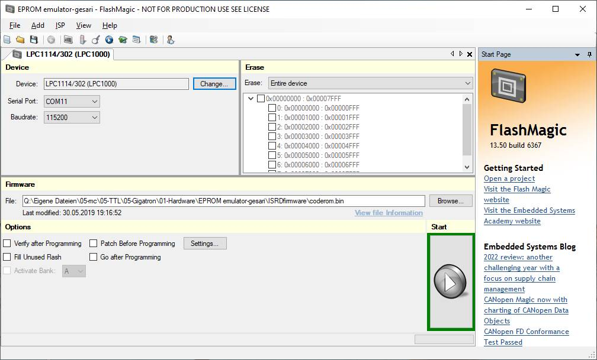

# My first steps with the ISD

## Installing the firmware on the LPC1114

The author recommends the lpc21isp tool for programming the microcontroller flash. It is available on Linux and Windows.
Ich habe unter Windows das Tool Flash Magic genutzt (https://www.flashmagictool.com/download.html):

I programmed the firmware without connecting the Gigatron to all three jumpers.

## Connection with a terminal program

If jumper JP1 (Vbus) is connected, the Gigatron is supplied with voltage via the USB port of the ISD. This should not be done simultaneously with the USB of the Gigatron. If the Gigatron is supplied with voltage directly, JP1 must not be connected.

Communication should be possible with any terminal program (115200 baud 8 data bits 1 stop bit and parity none, no flow control)

The transfer of data with XMODEM (ROM or gt1 file) I could only test successfully with HyperTerminal and ExtraPuTTYtel.

## SD card

Only 8.3 file names are supported for the SD card. Folders can exist and be searched. If there is a file with the name **ROM.BIN** in the root directory of the SD card, it is loaded automatically and the Gigatron is started.

[Back to the overview](https://github.com/hans61/Gigatron-TTL/tree/main/InCircuitEPROMemulator)