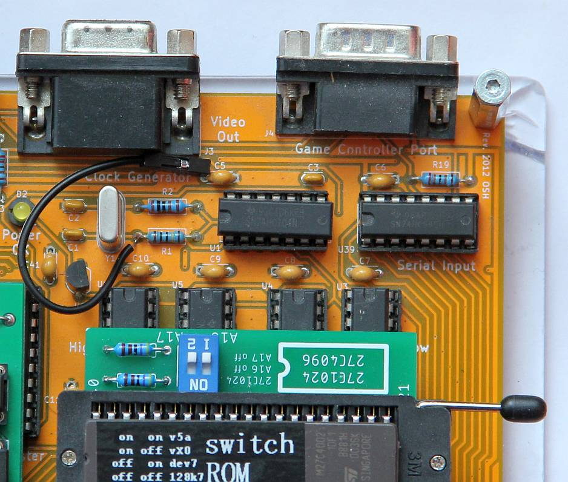
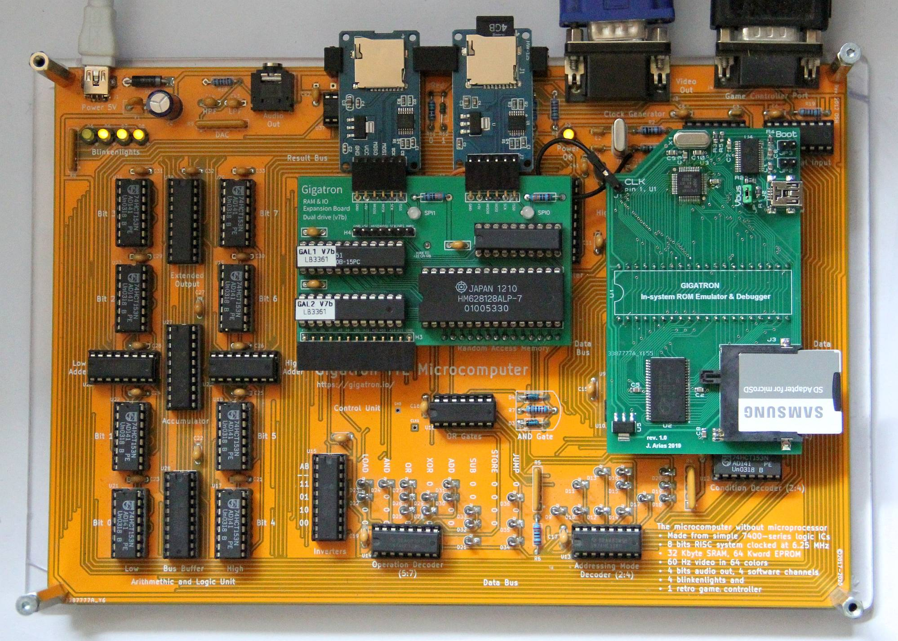
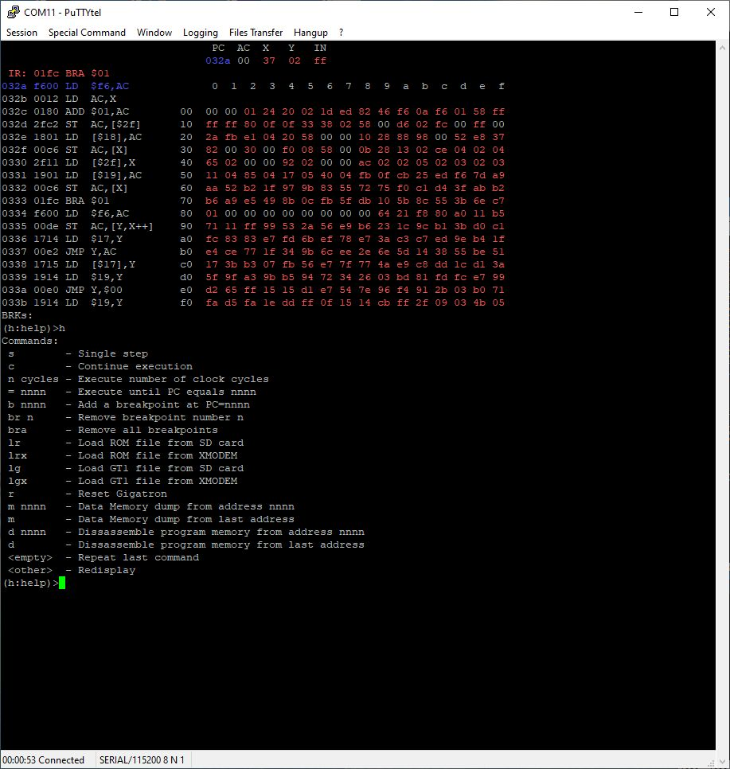
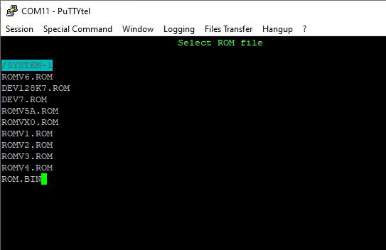
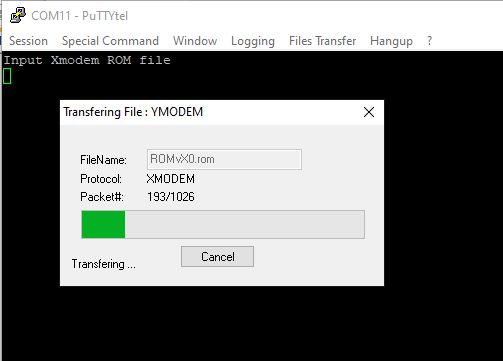

# In Circuit EPROM emulator and debugger (ISD = In System Debugger)

I am not the author of this project. The repositories is only for documenting my rebuild.

I came upon gesari (Jesus Arias) project here (https://forum.gigatron.io/viewtopic.php?f=4&t=112).

## My first replica

First I soldered the large components. In order FT232R, LPC1114 and CY7C1021D. After a visual inspection then all resistors and capacitors. Then the LD1117S33 and the USB port.
After attaching the crystal and the three jumpers, I did the first test.

After setting all three jumpers and connecting the USB to the computer, a new serial interface should now be recognized.

This only worked for me after connecting PIN 26 (TEST) to GND. That was easy since the neighbor PIN 25 is already on GND. I made a solder bridge between both PINs.

I transferred the firmware for the LPC1114 with the software FlashMagic 13.50 build 6367. (https://www.flashmagictool.com/download.html&d=flashmagic)

Then I removed all jumpers except for JP1 (Power from ISD USB). After that, a serial connection with interactive communication was possible.

After soldering the rest of the parts and removing JP1, it can be inserted into the Gigatron.

Before I soldered the cable for CLK to the Gigatron. It must be in the connection from the crystal to R1. It can be soldered very well to R1 from above. It also didn't affect operation without the board.

CLK wire on Gigatron

Gigatron with "In Circuit EPROM Emulator and Debugger"

[**Picture gallery of assembly the ISD**](https://github.com/hans61/Gigatron-TTL/blob/main/InCircuitEPROMemulator/Assembly.md)

[**Programming the firmware and using the SD card**](https://github.com/hans61/Gigatron-TTL/blob/main/InCircuitEPROMemulator/FirstSteps.md)

[**ISD Connection with the Gigatron**](https://github.com/hans61/Gigatron-TTL/blob/main/InCircuitEPROMemulator/ConnectionGigatronIsd.md)

## Use ISD

"In Circuit EPROM Emulator and Debugger" serial communication

"In Circuit EPROM Emulator and Debugger" serial communication load ROM from SD

"In Circuit EPROM Emulator and Debugger" serial communication load ROM from xmodem
