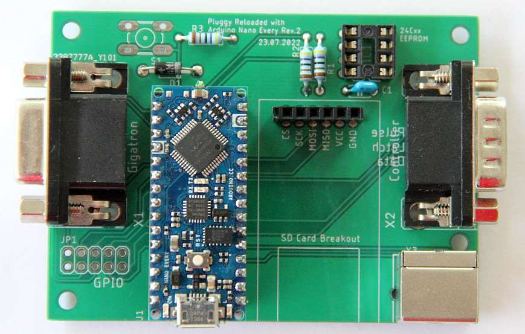

# Pluggy Reloaded
A new variant with the Arduino Nano Every with the new ATmega4809 CPU.
- 48KB Flash
- 6KB RAM
- 256B EEPROM

The reason it is at the moment better to get than the Pro Micro and in addition still more favorably (Reichelt approx. 10€)

I have also provided an I2C EEPROM, but have not made any software for it yet. I inserted and tested the board with the Arduino Nano Every 4809 in the existing software.

