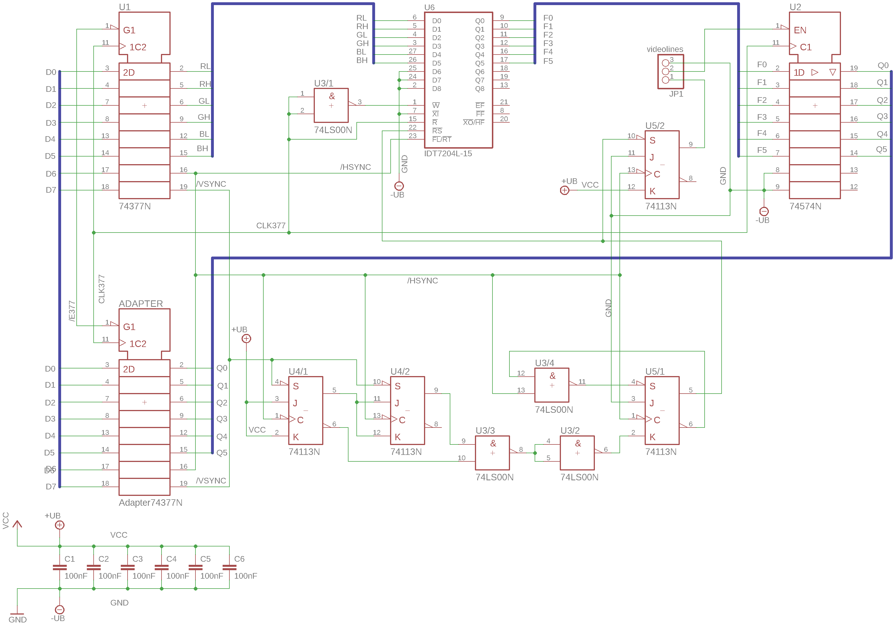

Video repeater for the Gigatron TTL computer Rev.3
==================================================
With the Gigatron TTL, a pixel consisting of 4 video lines is displayed in the VGA output. Since the video output is provided by software, it requires a large part of the computing power of the Gigatron. The video repeater records the first video line with a FIFO RAM and repeats it independently. The expansion has been tested and fits mechanically next to the "Expansion bus" (128k RAM + SPI) or the PCB from lb3361. The repeater adapts 74x377 (U37) from the mainboard.
It's the schematic from Axelb, thank you very much for the good work.

