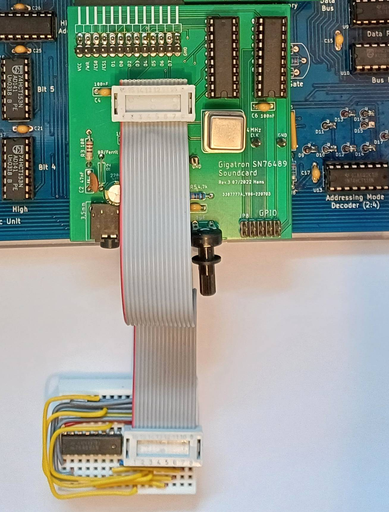

# sound card with sn76489
I accidentally stumbled across the sound chip sn76489. Since it can only be controlled via outputs, it is well suited for the extension-retro of lb3361.
This is my attempt for a Gigatron sound card (Rev.3 still in work).

Unfortunately, I haven't had any success so far in producing a reasonable sound on the board. Now I have finally discovered the cause of the problem.
The SN76489 is available in two different pinouts. The difference is mirrored data pins.

| SN76489 |          |          |
|   Pin   | Pinout 1 | Pinout 2 |
|:-------:|:--------:|:--------:|
|    3    |    D0    |    D7    |
|    2    |    D1    |    D6    |
|    1    |    D2    |    D5    |
|   15    |    D3    |    D4    |
|   13    |    D4    |    D3    |
|   12    |    D5    |    D2    |
|   11    |    D6    |    D1    |
|   10    |    D7    |    D0    |

Pinout 1:
https://map.grauw.nl/resources/sound/texas_instruments_sn76489an.pdf
Pinout 2:
https://en.m.wikipedia.org/wiki/Texas_Instruments_SN76489

I solved the problem on the breadboard for now.

I'm still testing a small adapter board. When she leaves I will post it here.
I will also rework the PCB itself.

First tests (fast cell phone video):
https://www.youtube.com/watch?v=wv5x-WD0vzI

